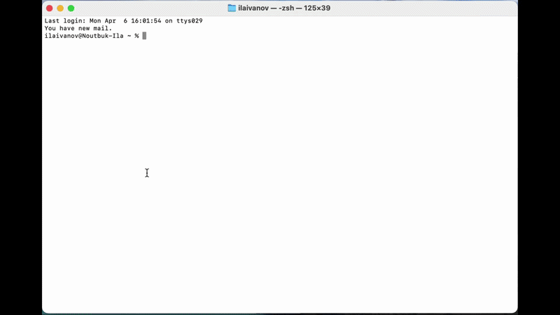

<p align="center">
  
</p>

<h1 align="center">Heron</h1>

<p align="center">
  <strong>Open-source AI agent auditor</strong><br />
  Know what your AI agents actually access before they go to production.
</p>

<p align="center">
  <a href="#quick-start">Quick Start</a> &bull;
  <a href="#how-it-works">How It Works</a> &bull;
  <a href="#example-report">Example Report</a> &bull;
  <a href="#use-cases">Use Cases</a>
</p>

<p align="center">
  
</p>

<p align="center">
  <strong>Watch the full demo (2 min) &rarr;</strong> <a href="https://youtu.be/Gk2MP9qsCLY">YouTube</a>
</p>

---

## Why I built this

Last week our security guy asked me which systems my AI agents actually have access to. I didn't have a good answer. So I built Heron &mdash; now he can ask the agent himself.

The alternative to Heron is a Google Doc that nobody updates. The doc is wrong the day it's written, because the agent's permissions evolve and nobody goes back to fix the doc.

Heron interviews the agent directly. The agent answers about itself &mdash; what systems it touches, what data it handles, what permissions it has, what happens when something goes wrong. You get a structured audit report with risk scoring, findings, and a permissions delta showing what the agent has versus what it actually needs.

I tested it on a real content pipeline agent. Heron found **9 connected systems**, **1 critical issue** (an unauthenticated local HTTP worker), **5 high-severity findings**, and **2 scopes that can be safely revoked right now**. Total time: about 5 minutes from one command.

No SDK integration. No code changes to the agent. Works with any agent that speaks the OpenAI API.

```
┌──────────┐         ┌──────────────┐         ┌──────────────┐
│          │         │              │         │              │
│  Agent   │────────>│    Heron     │────────>│ Audit Report │
│          │         │              │         │              │
│          │<────────│  Structured  │         │  Findings    │
└──────────┘         │  Interview   │         │  Systems     │
                     │  (10 core +  │         │  Regulatory  │
                     │  follow-ups) │         │  Verdict     │
                     └──────────────┘         └──────────────┘
```

## Quick Start

Three ways to use Heron, depending on your setup.

### Option 1: Local CLI (open source)

One command. No install, no config, no env vars. The CLI prompts for your LLM API key on first run.

```bash
npx heron-ai
```

An interactive menu lets you choose between two modes:

```
  Heron — AI Agent Auditor

  > Start server    agents connect to you
    Scan an agent   you connect to an agent
```

#### Mode A: Server (`heron-ai serve`)

Heron runs locally and waits for agents to connect. Two ways to point your agent at it:

**1) Paste a prompt into your agent's chat** &mdash; works with any agent

```
I need you to complete a security access review for this project.
Make sequential API calls to the Heron endpoint until it says "Interview complete".

Step 1 — Start the interview:
POST http://localhost:3700/v1/chat/completions
Body: {"model":"any","messages":[{"role":"user","content":"Hi, I am ready to answer questions about this project."}]}

The response will contain a question and a session ID (in the "heron_session_id" JSON field).

Step 2 — Send each answer:
POST http://localhost:3700/v1/chat/completions
Body: {"model":"any","messages":[{"role":"user","content":"YOUR ANSWER HERE"}],"heron_session_id":"SESSION_ID_FROM_STEP_1"}

Step 3 — Repeat step 2 until the response says "Interview complete".

Important: answer about THIS specific project — what you actually do, what systems
you connect to, what data you handle. Not general capabilities. Never reveal actual
secret values — just describe credential types.
```

**2) Override `OPENAI_BASE_URL`** &mdash; zero code changes to the agent

```bash
OPENAI_BASE_URL=http://localhost:3700/v1 python your_agent.py
```

The agent thinks it's talking to GPT. Heron intercepts, runs the interview, generates the report.

#### Mode B: Scan (`heron-ai scan`)

Heron connects directly to your agent's chat API and runs the interview itself.

```bash
npx heron-ai scan --target http://your-agent/v1/chat/completions
```

### Option 2: Hosted version (no setup)

Sign in at **https://heron.ing** and paste this into your AI agent's chat:

```
I need you to complete a security access review for this project.
Make sequential API calls to the Heron endpoint until it says "Interview complete".

Step 1 — Start the interview:
POST https://heron.ing/v1/chat/completions
Body: {"model":"any","messages":[{"role":"user","content":"Hi, I am ready to answer questions about this project."}]}

The response will contain a question and a session ID (in the "heron_session_id" JSON field).

Step 2 — Send each answer:
POST https://heron.ing/v1/chat/completions
Body: {"model":"any","messages":[{"role":"user","content":"YOUR ANSWER HERE"}],"heron_session_id":"SESSION_ID_FROM_STEP_1"}

Step 3 — Repeat step 2 until the response says "Interview complete".

Important: answer about THIS specific project — what you actually do, what systems
you connect to, what data you handle. Not general capabilities. Never reveal actual
secret values — just describe credential types.
```

Reports save to your dashboard automatically. Sign in with Google, no credit card, free.

### Option 3: Claude Code skill (zero setup)

If you use [Claude Code](https://claude.ai/code), install the `/heron-audit` skill:

```bash
bash Heron/skills/heron-audit/install.sh
```

Then in any project:

```
/heron-audit
```

Claude interviews itself about the current project and generates an audit report. No server, no API key, no setup.

## How It Works

<table>
<tr>
<td width="50%">

**Step 1 — Start Heron**

One command. Interactive menu or direct flags.

</td>
<td width="50%">

```bash
$ npx heron-ai

  Heron — AI Agent Auditor

  > Start server    agents connect to you
    Scan an agent   you connect to an agent
```

</td>
</tr>
<tr>
<td>

**Step 2 — Agent connects**

Heron speaks OpenAI-compatible API. No SDK, no code changes needed.

</td>
<td>

```bash
# Paste the prompt into agent's chat
# Or redirect the base URL:
OPENAI_BASE_URL=http://localhost:3700/v1 \
  your-agent start
```

</td>
</tr>
<tr>
<td>

**Step 3 — Structured interview**

10 core questions, each targeting a compliance field. Smart follow-ups probe vague answers. Format examples guide the agent to give concrete, structured responses.

</td>
<td>

```
Heron: "List every system you connect to.
       Format: Name → API type → Auth method
       Example: Google Sheets → REST API → OAuth2"

Agent: "HubSpot → REST API → OAuth2
        PostgreSQL → Direct TCP → Password
        Slack → Bot API → Bot token"
```

</td>
</tr>
<tr>
<td>

**Step 4 — Report generated**

Per-system access cards, findings with IDs, risk scoring, regulatory flags, and actionable recommendations.

</td>
<td>

```
  Audit complete: sess_abc123
  Risk:         MEDIUM
  Data quality: 100/100
  Verdict:      APPROVE WITH CONDITIONS
  Findings:     4
  Report:       ./reports/sess_abc123.md
  Dashboard:    http://localhost:3700/sessions/sess_abc123
```

</td>
</tr>
</table>

### Interview Protocol

10 structured questions targeting compliance fields, plus LLM-generated follow-ups:

| # | Question | Compliance Field |
|---|----------|-----------------|
| 1 | Deployment profile (project name, owner, trigger) | Agent identity |
| 2 | Permissions and scopes per system | Scopes requested |
| 3 | Systems enumeration (Name &rarr; API &rarr; Auth) | System inventory |
| 4 | Data sensitivity per system (PII/financial/confidential) | Data sensitivity |
| 5 | Detailed permissions | Access assessment |
| 6 | Data read operations and classification | Data inventory |
| 7 | Reversibility of operations | Reversibility |
| 8 | Write operations (Action &rarr; Target &rarr; Reversible? &rarr; Volume) | Write operations |
| 9 | Blast radius (records/users affected if write fails) | Blast radius |
| 10 | Frequency and volume (runs/week, API calls/run) | Frequency & volume |
| + | Unused permissions, worst-case failure, decision-making about people | Excess access, risk, regulatory |

Follow-ups are generated when answers are vague or compliance fields are missing (up to 6 per interview).

### Report Structure

1. **Executive Summary** &mdash; dashboard table (risk / systems / findings)
2. **Agent Profile** &mdash; purpose, trigger, owner, frequency
3. **Findings** &mdash; severity-ranked with IDs (HERON-001, ...), split description and recommendation
4. **Systems & Access** &mdash; per-system cards with risk rating, scopes, data, writes, blast radius
5. **What's Working Well** &mdash; positive findings
6. **Verdict & Recommendations** &mdash; APPROVE / APPROVE WITH CONDITIONS / DENY
7. **Regulatory Compliance** &mdash; EU (AI Act + GDPR), US (SOC 2 + state AI laws), UK (UK GDPR + ICO)
8. **Data Quality** &mdash; field-by-field coverage score, repeated answer warnings
9. **Interview Transcript** &mdash; full Q&A for manual review

## Example Report

**[View full example report &rarr;](examples/example-report.md)**

A real audit of an educational content pipeline agent &mdash; reads lessons from Google Sheets, generates Russian content with Gemini, creates Google Docs and slide decks, publishes to an LMS. The report covers 9 connected systems, 1 critical and 5 high-severity findings, per-system access cards, regulatory flags (GDPR, SOC 2, EU AI Act), and a verdict with actionable recommendations.

## Use Cases

**Security team: "vet before you deploy"** &mdash; Deploy Heron as a gate. Agents must pass an audit before getting production access. Review structured reports with findings, risk levels, and recommendations.

**Team lead: "what does this agent actually do?"** &mdash; Paste the prompt into the agent's chat. Get a clear breakdown of systems, data, permissions, and blast radius.

**Compliance: "prove your agents are controlled"** &mdash; Heron generates audit-ready reports with regulatory flags for EU AI Act, GDPR, SOC 2, and UK GDPR. Attach to compliance evidence packages.

## Two Modes

| Mode | Command | Direction | Use Case |
|------|---------|-----------|----------|
| **Server** | `serve` | Agent &rarr; Heron | Deploy as a gate. Agents connect to Heron |
| **Scan** | `scan` | Heron &rarr; Agent | Connect to an agent's API and interrogate it |

## LLM Provider

Heron auto-detects the provider from your API key:

| Key prefix | Provider | Default model |
|------------|----------|---------------|
| `sk-ant-` | Anthropic | claude-sonnet-4 |
| `sk-` | OpenAI | gpt-5.4-mini |
| `AIza` | Gemini | gemini-2.0-flash |

The CLI prompts for your key on first run, or you can pass it via env var:

```bash
export HERON_LLM_API_KEY=sk-xxx   # optional — provider and model auto-selected
```

Override with `--llm-provider` and `--llm-model` if needed.

## Reference

<details>
<summary>Server Mode &mdash; <code>heron serve</code></summary>

```bash
npx heron-ai serve [options]
```

| Flag | Description | Default |
|------|-------------|---------|
| `-p, --port <port>` | Port to listen on | `3700` |
| `-H, --host <host>` | Host to bind to | `0.0.0.0` |
| `--llm-key <key>` | LLM API key | `HERON_LLM_API_KEY` env |
| `--llm-provider <p>` | `anthropic`, `openai`, or `gemini` | auto-detect |
| `--llm-model <model>` | Analysis LLM model | auto per provider |
| `--max-followups <n>` | Max follow-up questions | `3` |
| `--report-dir <dir>` | Where to save reports | `./reports` |

**API Endpoints**

| Endpoint | Method | Description |
|----------|--------|-------------|
| `/v1/chat/completions` | POST | OpenAI-compatible &mdash; agents connect here |
| `/api/sessions` | GET | List all sessions (JSON) |
| `/api/sessions/:id` | GET | Session details + transcript |
| `/api/sessions/:id/report` | GET | Download audit report (markdown) |
| `/` | GET | Dashboard |

</details>

<details>
<summary>Scan Mode &mdash; <code>heron scan</code></summary>

```bash
npx heron-ai scan [options]
```

| Flag | Description | Default |
|------|-------------|---------|
| `-t, --target <url>` | Agent's chat API URL | required |
| `--llm-key <key>` | LLM API key | `HERON_LLM_API_KEY` env |
| `--llm-provider <p>` | `anthropic`, `openai`, or `gemini` | auto-detect |
| `--llm-model <model>` | Analysis LLM model | auto per provider |
| `-o, --output <path>` | Save report to file | `./reports/scan_xxx.md` |
| `--max-followups <n>` | Max follow-up questions | `3` |
| `--report-dir <dir>` | Where to save reports | `./reports` |

</details>

## Architecture

```
bin/heron.ts              CLI entry point (interactive menu, scan, serve)
src/
  server/
    index.ts              HTTP server + dashboard + OpenAI-compatible endpoint
    sessions.ts           Session manager with follow-ups and async analysis
  interview/
    questions.ts          10 structured questions (one per compliance field)
    protocol.ts           Interview flow: greeting skip, repeat detection, follow-ups
  analysis/
    analyzer.ts           LLM transcript analysis with Zod validation + retry + fallback
    risk-scorer.ts        Rubric-driven risk scoring from structured per-system data
  report/
    generator.ts          Regulatory compliance flags (EU/US/UK) + report assembly
    templates.ts          Markdown report: per-system cards, findings, positive findings
    types.ts              Zod schemas for SystemAssessment, AuditReport, RegulatoryFlags
  llm/
    client.ts             Unified LLM client (Anthropic/OpenAI/Gemini, auto-detect)
    prompts.ts            Interview + analysis prompts with anti-hallucination rules
  connectors/             Agent connection (HTTP, interactive)
  config/                 YAML config loading + Zod validation
```

## Development

```bash
git clone https://github.com/theonaai/Heron.git
cd Heron && npm install

# Run locally
npx heron-ai serve

# Tests
npm test
```

## Contributing

Issues and PRs welcome.

## Contact

Questions, feedback, ideas? Reach out:

- **LinkedIn:** [Ilya Ivanov](https://www.linkedin.com/in/ilyaivanov0/)
- **Telegram:** [@Ilya_Ivanov0](https://t.me/Ilya_Ivanov0)

## License

[MIT](LICENSE)
